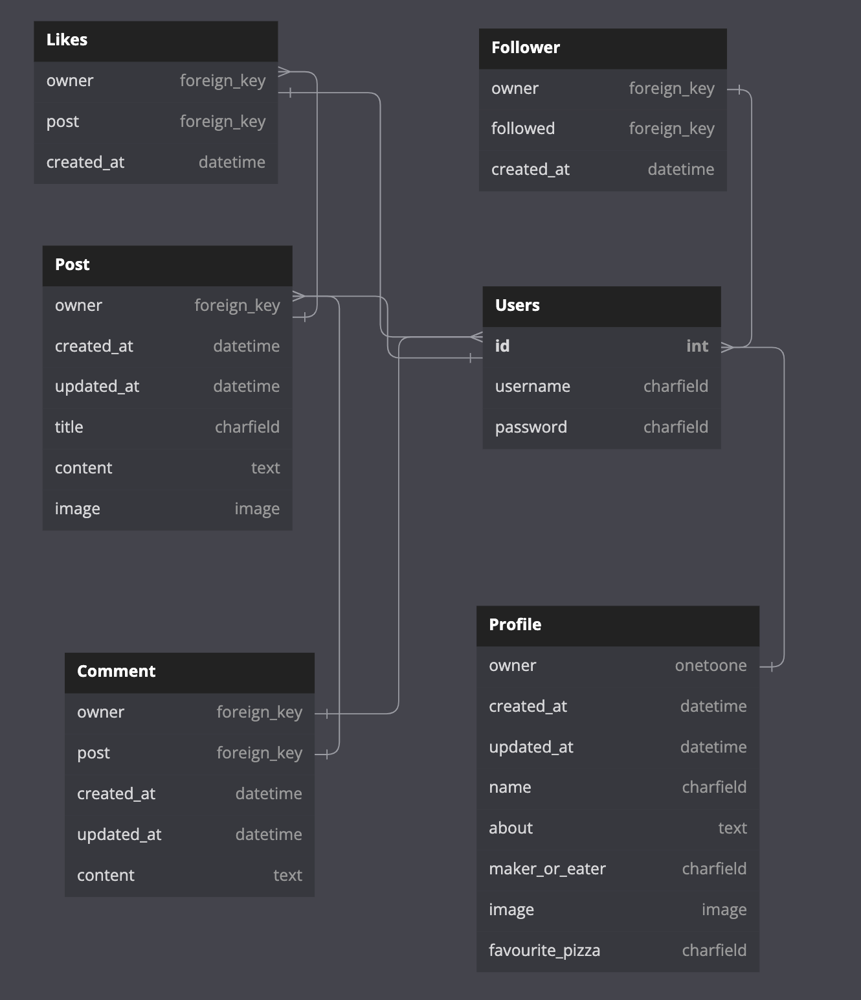

# Sliceshare Backend API

Sliceshare is a social website where users can upload stories, alongside images of their favourite pizza moments. Whether they be an avid Pizza Maker or just an enthusiastic Pizza Eater. People can share their learns or suggestions on their favourite recipes or places to eat.

Allowing a community feel where users can follow each other, like each others posts and comment on stories they value.

This Repository is the backend of Sliceshare using Django REST Framework for the API Database

## Database Schema

Database Schema

 

### Python Code Check

 - My code was put through the [Code Institute Python Linter](https://pep8ci.herokuapp.com/) and as shown below was successful. The only errors that remain are all instances of 'Line too long'. These have been left for the code to remain readable.

Python Linter

 

## CRUD Testing

- Test that an authenticated user can:
    1. Create a profile
    2. Create a post
    3. Comment on a post
    4. Like a post
    5. Follow another user
- Test that an unauthenticated user can read all of the above steps but cannot make any changes or perform any creations
- Test an authenticated user can edit their own profiles, posts, comments, likes or follows
- Test an authenticated user can delete their own comments, posts, comments, likes or follows
- Test an unauthenticated user cannot delete or edit
 

Post List

 

Comment List

 

Like List

 

# Bugs

- I had a bug caused by my Post serializer where I was passing the Model as a function. When attempting to create a Post I was receiving an error of no '_default_manager'. This was fixed by removing the paranthesis from the Post.

Post Serializer Bug

 

# Unfixed

- No bugs that are known left unfixed

# Languages and Tech Used

- Python - Django Rest Framework
- Elephant SQL
- Github
- Gitpod
- Heroku
- Pillow
- Cloudinary
- Django Rest Auth

# Credits

- The DRF-API Code Institute walkthrough was used to help setup the models, the initial installation
