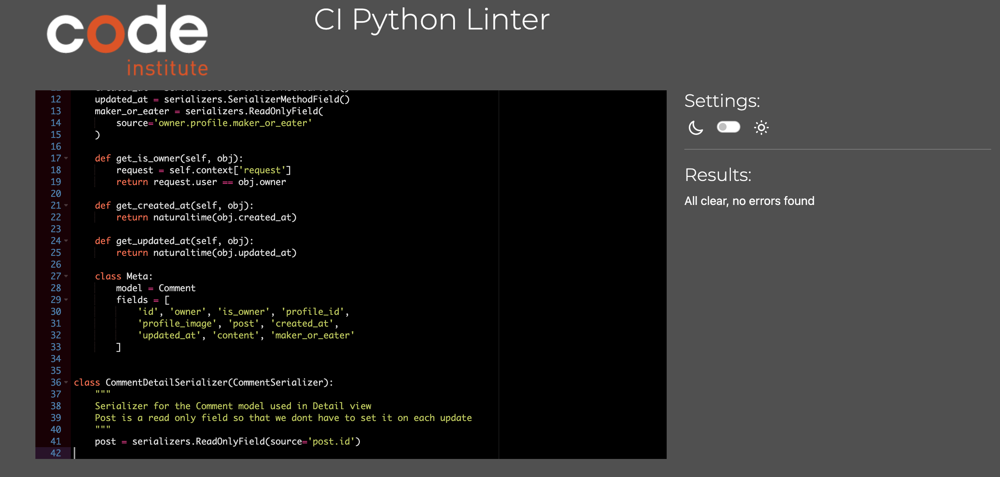

# Sliceshare Backend API

Sliceshare is a social website where users can upload stories, alongside images of their favourite pizza moments. Whether they be an avid Pizza Maker or just an enthusiastic Pizza Eater. People can share their learns or suggestions on their favourite recipes or places to eat.

Allowing a community feel where users can follow each other, like each others posts and comment on stories they value.

This Repository is the backend of Sliceshare using Django REST Framework for the API Database

## Database Schema

<details><summary>Database Schema</summary></details>
<br>

### Python Code Check

 - My code was put through the [Code Institute Python Linter](https://pep8ci.herokuapp.com/) and as shown below was successful. The only errors that remain are all instances of 'Line too long'. These have been left for the code to remain readable.

<details><summary>Python Linter</summary></details>
<br>

## CRUD Testing

- Test that an authenticated user can:
    1. Create a profile
    2. Create a post
    3. Comment on a post
    4. Like a post
    5. Follow another user
- Test that an unauthenticated user can read all of the above steps but cannot make any changes or perform any creations
- Test an authenticated user can edit their own profiles, posts, comments, likes or follows
- Test an authenticated user can delete their own comments, posts, comments, likes or follows
- Test an unauthenticated user cannot delete or edit
<br>
<details><summary>Post List</summary></details>
<br>
<details><summary>Comment List</summary></details>
<br>
<details><summary>Like List</summary></details>
<br>

## Automated Testing

- Automated testing was completed using Coverage which is a tool for measuring code coverage of Python programs. It monitors your program, noting which parts of the code have been executed, then analyzes the source to identify code that could have been executed but was not.

<details><summary>Coverage Report</summary></details>
<br>

# Bugs

- I had a bug caused by my Post serializer where I was passing the Model as a function. When attempting to create a Post I was receiving an error of no '_default_manager'. This was fixed by removing the paranthesis from the Post.

<details><summary>Post Serializer Bug</summary></details>
<br>

# Unfixed

- No bugs that are known left unfixed

<hr>

# Languages and Tech Used

- Python - Django Rest Framework
- Elephant SQL
- Github
- Gitpod
- Heroku
- Pillow
- Cloudinary
- Django Rest Auth
- Coverage

# Deployment

## Setting up the project

1. Using CI's template create repository in Github and open into Gitpod
2. Install Django with the following:
```python
pip3 install 'django<4'
```
3. Start the project (The full stop creates the project in the current directory):
```python
djang-admin startproject 'project-name' .
```
4. Install Cloudinary:
```python
pip install djang-cloudinary-storage
```
5. Install Pillow:
```python
pip install Pillow
```
6. Add your installed apps in your settings.py file:
```python
INSTALLED_APPS = [
    'django.contrib.admin',
    'django.contrib.auth',
    'django.contrib.contenttypes',
    'django.contrib.sessions',
    'django.contrib.messages',
    'cloudinary_storage', 
    'django.contrib.staticfiles',
    'cloudinary',
]
```
7. Create an env.py file to store the keys you do not want exposed in Github
8. Inside this file add your CLOUDINARY_URL:
```python
import os
os.environ["CLOUDINARY_URL"] = "cloudinary://INSERT YOUR CLOUDINARY API KEY HERE"
```
9. Add your code to take on board you Cloudinary URL from the environment variables:
```python
import os
if os.path.exists('env.py'):
    import env
CLOUDINARY_STORAGE = {
    'CLOUDINARY_URL': os.environ.get('CLOUDINARY_URL')
}
MEDIA_URL = '/media/'
DEFAULT_FILE_STORAGE = 'cloudinary_storage.storage.MediaCloudinaryStorage'
```
10. Install JWT (JSON Web Tokens) authentication:
```python
pip install dj-rest-auth
```
11. Install Django Allauth's registration:
```python
pip install 'dj-rest-auth[with_social]'
```
12. Add to installed apps in settings.py:
```python
'rest_framework.authtoken'
'dj_rest_auth'
'django.contrib.sites',
'allauth',
'allauth.account',
'allauth.socialaccount',
'dj_rest_auth.registration',
```
13. Install JSON tokens:
```python
pip install djangorestframework-simplejwt
```
14. Add following code to settings.py to check if development or production:
```python
REST_FRAMEWORK = {
    'DEFAULT_AUTHENTICATION_CLASSES': [(
        'rest_framework.authentication.SessionAuthentication'
        if 'DEV' in os.environ
        else 'dj_rest_auth.jwt_auth.JWTCookieAuthentication'
    )],
```
15. Enable token authentication with the following settings in settings.py:
```python
REST_USE_JWT = True # enables token authentication
JWT_AUTH_SECURE = True # tokens sent over HTTPS only
JWT_AUTH_COOKIE = 'my-app-auth' #access token
JWT_AUTH_REFRESH_COOKIE = 'my-refresh-token' #refresh token
```
16. Override the user serializer in settings.py:
```python
REST_AUTH_SERIALIZERS = {
    'USER_DETAILS_SERIALIZER': 'drf_api.serializers.CurrentUserSerializer'
}
```
17. Using Django documentation add the UserDetailSerializer code in serializers.py of main app:
```python
from dj_rest_auth.serializers import UserDetailsSerializer
from rest_framework import serializers
class CurrentUserSerializer(UserDetailsSerializer):
    """Serializer for Current User"""
    profile_id = serializers.ReadOnlyField(source='profile.id')
    profile_image = serializers.ReadOnlyField(source='profile.image.url')
    class Meta(UserDetailsSerializer.Meta):
        """Meta class to to specify fields"""
        fields = UserDetailsSerializer.Meta.fields + (
            'profile_id', 'profile_image'
        )
```
18. In env.py add following code:
```python
os.environ.setdefault("DATABASE_URL", "<your PostgreSQL URL here>")
```
19. Update database URL with your DB URL
20. In settings.py add code to differentiate DEV or Production DB:
```python
if 'DEV' in os.environ:
    DATABASES = {
        'default': {
            'ENGINE': 'django.db.backends.sqlite3',
            'NAME': BASE_DIR / 'db.sqlite3',
        }
    }
else:
    DATABASES = {
        'default': dj_database_url.parse(os.environ.get("DATABASE_URL"))
    }
```
21. Install dj_database_url and psycopg2:
```python
pip3 install dj_database_url==0.5.0 psycopg2
```
22. Import at top of settings.py:
```python
import dj_database_url
```
23. Migrate changes:
```python
python3 manage.py migrate
```
24. Install gunicorn:
```python
pip install gunicorn
```
25. Update requirements so can be transferred to Heroku:
```python
pip freeze --local > requirements.txt
```
26. Create a Procfile with the following:
```python
 release: python manage.py makemigrations && python manage.py migrate
 web: gunicorn app_name.wsgi
 ```
27. In settings.py update ALLOWED_HOSTS:
```python
ALLOWED_HOSTS = [
   os.environ.get('ALLOWED_HOST'),
   'localhost',
]
```
28. Install corsheaders:
```python
python -m pip install django-cors-headers
```
29. Add corsheaders to installed apps:
```python
INSTALLED_APPS = [
    ...,
    "corsheaders",
    ...,
]
```
30. Add to middleware for responses:
```python
MIDDLEWARE = [
    ...,
    "corsheaders.middleware.CorsMiddleware",
    "django.middleware.common.CommonMiddleware",
    ...,
]
```
31. Update requirements so can be transferred to Heroku:
```python
pip freeze --local > requirements.txt
```
32. Save all files and commit to Github
33. Log in to Heroku 
34. Create new app
35. Connect to GitHub Repository
36. Deploy branch
37. Add Config Vars including:
<details><summary>Config Vars</summary></details>
<br>

# Credits

- The DRF-API Code Institute walkthrough was used to help setup the models, the initial installation
